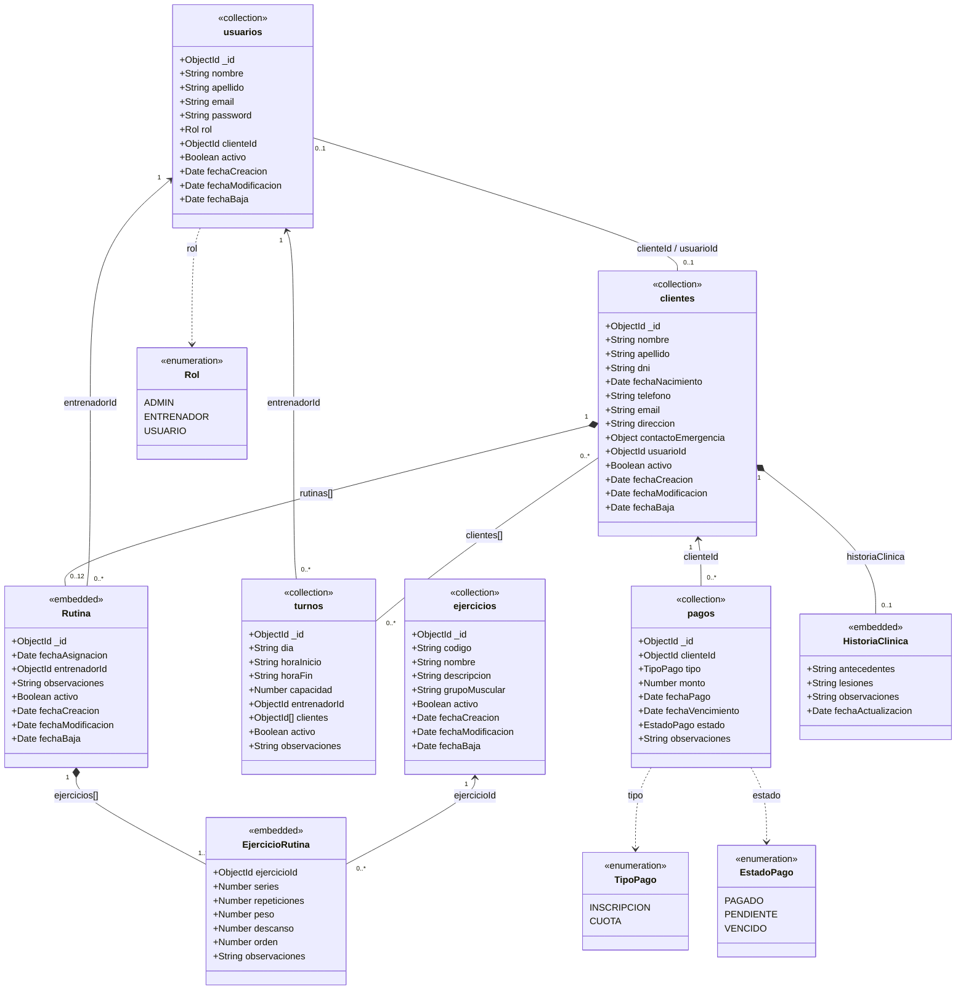

### Diagrama

```mermaid
classDiagram

    %% =====================================================
    %% COLECCIONES PRINCIPALES DE MONGODB
    %% =====================================================

    class usuarios {
        <<collection>>
        +ObjectId _id
        +String nombre
        +String apellido
        +String email
        +String password
        +Rol rol
        +ObjectId clienteId
        +Boolean activo
        +Date fechaCreacion
        +Date fechaModificacion
        +Date fechaBaja
    }

    class clientes {
        <<collection>>
        +ObjectId _id
        +String nombre
        +String apellido
        +String dni
        +Date fechaNacimiento
        +String telefono
        +String email
        +String direccion
        +Object contactoEmergencia
        +ObjectId usuarioId
        +Boolean activo
        +Date fechaCreacion
        +Date fechaModificacion
        +Date fechaBaja
    }

    class ejercicios {
        <<collection>>
        +ObjectId _id
        +String codigo
        +String nombre
        +String descripcion
        +String grupoMuscular
        +Boolean activo
        +Date fechaCreacion
        +Date fechaModificacion
        +Date fechaBaja
    }

    class turnos {
        <<collection>>
        +ObjectId _id
        +String dia
        +String horaInicio
        +String horaFin
        +Number capacidad
        +ObjectId entrenadorId
        +ObjectId[] clientes
        +Boolean activo
        +String observaciones
    }

    class pagos {
        <<collection>>
        +ObjectId _id
        +ObjectId clienteId
        +TipoPago tipo
        +Number monto
        +Date fechaPago
        +Date fechaVencimiento
        +EstadoPago estado
        +String observaciones
    }


    %% =====================================================
    %% DOCUMENTOS EMBEBIDOS
    %% =====================================================

    class Rutina {
        <<embedded>>
        +ObjectId _id
        +Date fechaAsignacion
        +ObjectId entrenadorId
        +String observaciones
        +Boolean activo
        +Date fechaCreacion
        +Date fechaModificacion
        +Date fechaBaja
    }

    class EjercicioRutina {
        <<embedded>>
        +ObjectId ejercicioId
        +Number series
        +Number repeticiones
        +Number peso
        +Number descanso
        +Number orden
        +String observaciones
    }

    class HistoriaClinica {
        <<embedded>>
        +String antecedentes
        +String lesiones
        +String observaciones
        +Date fechaActualizacion
    }


    %% =====================================================
    %% ENUMERACIONES / VALORES POSIBLES
    %% =====================================================

    class Rol {
        <<enumeration>>
        ADMIN
        ENTRENADOR
        USUARIO
    }

    class TipoPago {
        <<enumeration>>
        INSCRIPCION
        CUOTA
    }

    class EstadoPago {
        <<enumeration>>
        PAGADO
        PENDIENTE
        VENCIDO
    }


    %% =====================================================
    %% ESTRUCTURA EMBEBIDA
    %% =====================================================

    clientes "1" *-- "0..12" Rutina : rutinas[]

    clientes "1" *-- "0..1" HistoriaClinica : historiaClinica

    Rutina "1" *-- "1..*" EjercicioRutina : ejercicios[]


    %% =====================================================
    %% REFERENCIAS MEDIANTE OBJECTID
    %% =====================================================

    usuarios "0..1" -- "0..1" clientes : clienteId / usuarioId

    clientes "1" <-- "0..*" pagos : clienteId

    usuarios "1" <-- "0..*" turnos : entrenadorId

    clientes "0..*" -- "0..*" turnos : clientes[]

    usuarios "1" <-- "0..*" Rutina : entrenadorId

    ejercicios "1" <-- "0..*" EjercicioRutina : ejercicioId


    %% =====================================================
    %% ENUMERACIONES UTILIZADAS POR LOS CAMPOS
    %% =====================================================

    usuarios ..> Rol : rol

    pagos ..> TipoPago : tipo

    pagos ..> EstadoPago : estado
```