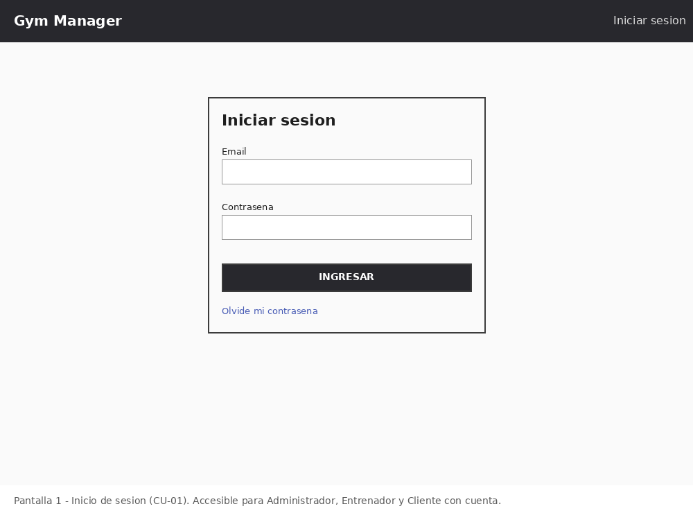
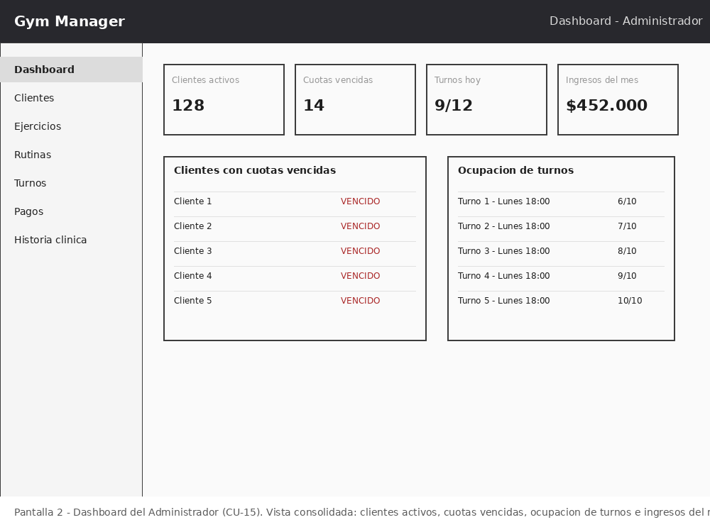
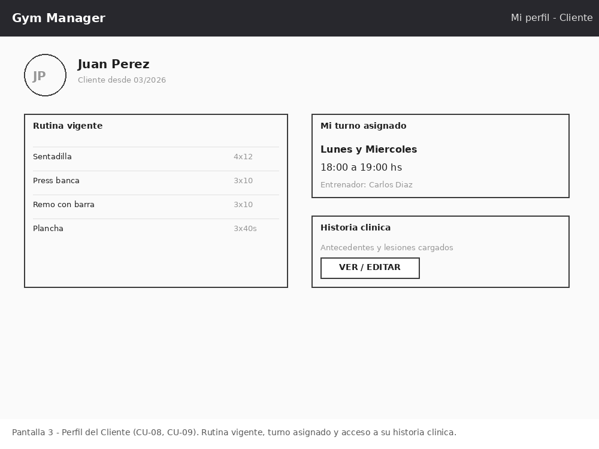
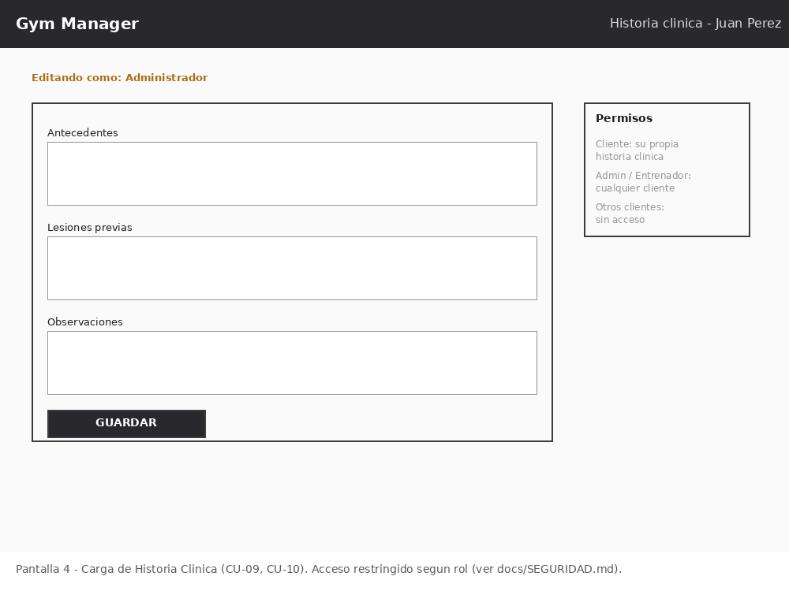
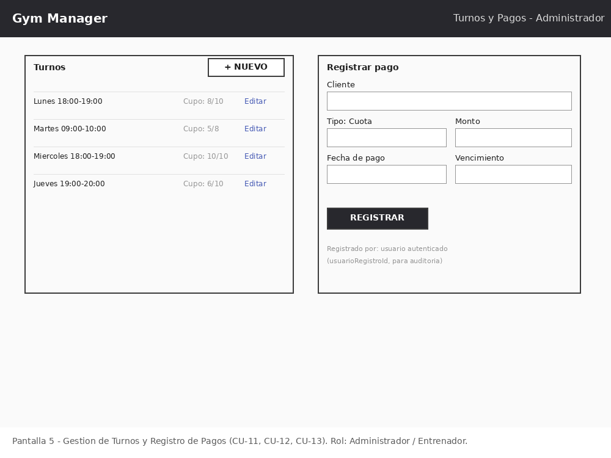

# Mockups — Gym Manager

## Descripción

Mockups de baja fidelidad de las pantallas principales del sistema, pensados para ilustrar la disposición de la información descrita en `MODULOS.md` y `CASOS_DE_USO.md`. No definen diseño visual final (colores, tipografía, branding), que se trabajará en la etapa de desarrollo.

---

## 1. Inicio de sesión

Pantalla de acceso para Administrador, Entrenador y Cliente con cuenta (CU-01), con opción de recuperar contraseña (CU-02).

---

## 2. Dashboard del Administrador

Vista consolidada con los indicadores definidos en el Módulo 8: clientes activos, cuotas vencidas, ocupación de turnos e ingresos del mes (CU-15).

---

## 3. Perfil del Cliente

Vista del cliente con cuenta: su rutina vigente, su turno asignado, y acceso a su historia clínica (CU-08, CU-09).

---

## 4. Historia Clínica

Formulario de carga/edición de historia clínica. El panel de permisos refleja el control de acceso definido en `docs/SEGURIDAD.md` (Cliente: la propia; Administrador/Entrenador: cualquier cliente; otros clientes: sin acceso).

---

## 5. Gestión de Turnos y Pagos

Panel del Administrador/Entrenador para crear turnos y registrar pagos (CU-11, CU-12, CU-13), incluyendo el registro de auditoría (`usuarioRegistroId`).